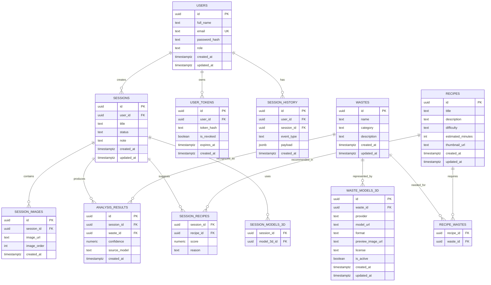

# Backend Blueprint: FastAPI + Supabase + 3D Model Storage

## 1) ERD de xuat cho project



## 2) Khoi tao Supabase de luu du lieu thuong

### Buoc A: Tao project

1. Vao https://supabase.com, tao project moi.
2. Lay cac bien can dung:
- `SUPABASE_URL`
- `SUPABASE_ANON_KEY`
- `SUPABASE_SERVICE_ROLE_KEY`

### Buoc B: Cau hinh bien moi truong

Tao file `.env` (dua tren `.env.example`):

```env
APP_ENV=development
SUPABASE_URL=https://your-project-ref.supabase.co
SUPABASE_ANON_KEY=your-anon-key
SUPABASE_SERVICE_ROLE_KEY=your-service-role-key
MODEL_CDN_BASE_URL=https://cdn.your-storage.com/models
```

### Buoc C: Tao bang trong Supabase (SQL Editor)

```sql
create table if not exists users (
  id uuid primary key default gen_random_uuid(),
  full_name text not null,
  email text not null unique,
  password_hash text not null,
  role text not null default 'user',
  created_at timestamptz not null default now(),
  updated_at timestamptz not null default now()
);

create table if not exists sessions (
  id uuid primary key default gen_random_uuid(),
  user_id uuid not null references users(id) on delete cascade,
  title text not null,
  status text not null default 'pending',
  note text,
  created_at timestamptz not null default now(),
  updated_at timestamptz not null default now()
);

create table if not exists wastes (
  id uuid primary key default gen_random_uuid(),
  name text not null,
  category text,
  description text,
  created_at timestamptz not null default now(),
  updated_at timestamptz not null default now()
);

create table if not exists recipes (
  id uuid primary key default gen_random_uuid(),
  title text not null,
  description text not null,
  difficulty text,
  estimated_minutes int,
  thumbnail_url text,
  created_at timestamptz not null default now(),
  updated_at timestamptz not null default now()
);

create table if not exists waste_models_3d (
  id uuid primary key default gen_random_uuid(),
  waste_id uuid not null references wastes(id) on delete cascade,
  provider text not null,
  model_url text not null,
  format text not null default 'glb',
  preview_image_url text,
  license text,
  is_active boolean not null default true,
  created_at timestamptz not null default now(),
  updated_at timestamptz not null default now()
);
```

### Buoc D: Ket noi Supabase trong FastAPI

Vi du client don gian:

```python
# app/core/supabase_client.py
import os
from supabase import Client, create_client


def get_supabase_client() -> Client:
    url = os.getenv("SUPABASE_URL", "")
    key = os.getenv("SUPABASE_SERVICE_ROLE_KEY", "")
    if not url or not key:
        raise ValueError("Missing SUPABASE_URL or SUPABASE_SERVICE_ROLE_KEY")
    return create_client(url, key)
```

Sau do co the inject vao service layer de thao tac CRUD.

## 3) Luu model 3D tren nen tang khac + luu link vao Supabase

Nen tang luu model 3D nen tach rieng (R2, S3, Cloudinary, GCS, Firebase Storage) de:
- toi uu bang thong/chi phi storage
- CDN tai file `.glb/.gltf/.usdz` nhanh hon
- de quan ly version model

### Quy trinh de xuat

1. Upload file model len storage ngoai (vd: S3/R2).
2. Nhan `public_url` hoac signed URL.
3. Ghi metadata model vao bang `waste_models_3d` trong Supabase.
4. API `/session/3D` va `/session/AR` doc metadata nay de tra cho frontend.

### Metadata nen luu trong Supabase

- `provider`: ten platform (`s3`, `cloudinary`, `r2`...)
- `model_url`: link truy cap model
- `format`: `glb`, `gltf`, `usdz`
- `preview_image_url`: anh preview
- `license`: thong tin license
- `is_active`: model con su dung hay khong
- (khuyen nghi) `checksum` va `version` de quan ly cap nhat file

### Vi du insert metadata sau khi upload

```python
supabase.table("waste_models_3d").insert(
    {
        "waste_id": "<waste_uuid>",
        "provider": "cloudflare_r2",
        "model_url": "https://cdn.example.com/models/pot-v2.glb",
        "format": "glb",
        "preview_image_url": "https://cdn.example.com/previews/pot-v2.png",
        "license": "CC-BY-4.0",
        "is_active": True,
    }
).execute()
```

## 4) Mapping nhanh route <-> doi tuong du lieu

- `/dashboard`: tong hop tu `sessions`, `users`, `recipes`, `wastes`
- `/session/analyze`: tao ban ghi xu ly + `session_images`
- `/session/analyze (GET)`: doc `analysis_results`
- `/session/analyze/recipes`: goi y tu `recipes` + mapping waste
- `/session/3D`: doc `waste_models_3d`
- `/session/AR`: doc `waste_models_3d` + `recipes`
- `/session/history`: doc `session_history`
- `/admin/*`: CRUD cac bang chinh
